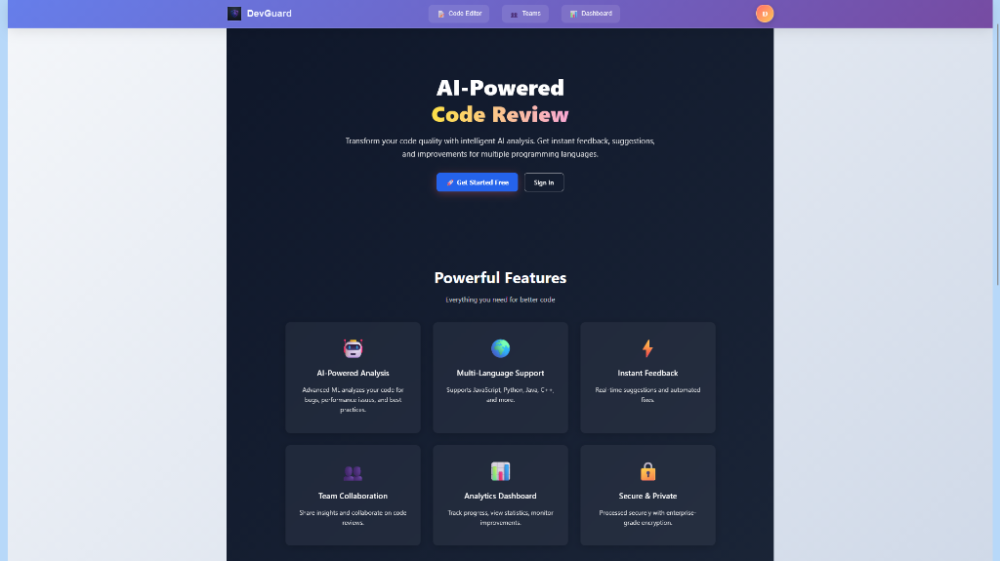
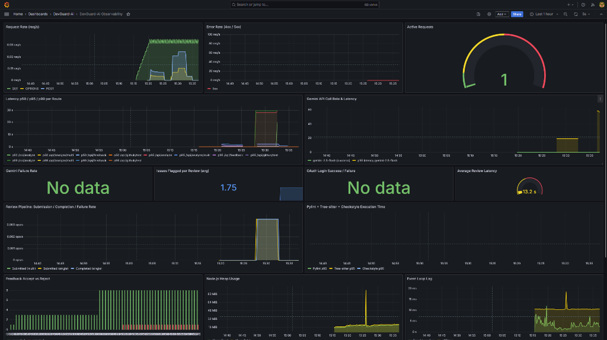

<div align="center">

# 🛡️ DevGuard-AI

**AI-powered code review platform that combines static analysis with semantic AI to automate reviews, learn from developer feedback, and provide team-wide analytics.**

[](https://nodejs.org/)
[](https://react.dev/)
[](https://expressjs.com/)
[](https://ai.google.dev/)
[](https://supabase.com/)
[](https://www.docker.com/)
[](https://prometheus.io/)
[](https://grafana.com/)
[](https://grafana.com/oss/loki/)
[](https://pylint.org/)

*Most code review tools are either static linters that miss context or AI wrappers that hallucinate fixes. DevGuard combines both — and learns from your rejections.*



</div>

---

## The Problem

Code review is the largest bottleneck in modern development workflows. Senior engineers spend **30–40% of their time** reviewing junior code, yet still miss semantic bugs that linters can't catch. Static tools flag style issues but ignore logic flaws, security vulnerabilities, and architectural anti-patterns. Meanwhile, AI-only solutions lack the deterministic guarantees that linters provide.

DevGuard solves this by running a **multi-agent pipeline** — deterministic static analyzers catch what they're good at (syntax, style, naming), while Gemini AI handles what requires understanding (logic errors, security patterns, architectural coupling). When a developer rejects a suggestion, the system remembers — and stops repeating it.

---

## Architecture

```
┌──────────────────────────────────────────────────────────────────────────┐
│                           React Frontend (Vite)                         │
│     Code Editor │ Multi-file Upload │ Team Dashboards │ Feedback UI     │
└─────────────────────────────┬────────────────────────────────────────────┘
                              │ HTTP (port 5173 → 5000)
┌─────────────────────────────▼────────────────────────────────────────────┐
│                        Express.js Backend                                │
│                                                                          │
│  ┌─────────────┐  ┌──────────────┐  ┌──────────────┐  ┌─────────────┐  │
│  │ Request ID   │  │   Metrics    │  │    Auth      │  │   CORS /    │  │
│  │ Middleware   │  │  Middleware   │  │  Middleware   │  │   JSON      │  │
│  │(AsyncLocal)  │  │ (prom-client)│  │ (Supabase)   │  │             │  │
│  └──────┬───────┘  └──────┬───────┘  └──────┬───────┘  └─────────────┘  │
│         │                 │                 │                             │
│  ┌──────▼─────────────────▼─────────────────▼──────────────────────────┐ │
│  │                      Route Handlers (25 endpoints)                  │ │
│  │  /api/analyze    /api/feedback    /api/teams    /api/github         │ │
│  │  /api/stats      /api/rejections  /metrics                         │ │
│  └──────┬───────────────┬────────────────┬─────────────────────────────┘ │
│         │               │                │                               │
│  ┌──────▼───────┐ ┌─────▼──────┐  ┌─────▼──────┐                       │
│  │ Static       │ │  Gemini    │  │  Supabase  │                       │
│  │ Analyzers    │ │  3-model   │  │ PostgreSQL │                       │
│  │              │ │  fallback  │  │            │                       │
│  │ • Pylint     │ │  chain     │  │ • feedback │                       │
│  │ • Tree-sitter│ │            │  │ • teams    │                       │
│  │ • Checkstyle │ │ flash →    │  │ • members  │                       │
│  │ • JS Analyzer│ │ pro →      │  │ • profiles │                       │
│  └──────────────┘ │ 1.0-pro    │  │ • peers    │                       │
│                   └────────────┘  └────────────┘                       │
└──────────────────────────────────────────────────────────────────────────┘
                              │
              ┌───────────────┼───────────────┐
              ▼               ▼               ▼
     ┌──────────────┐ ┌──────────────┐ ┌──────────────┐
     │  Prometheus  │ │    Loki      │ │   Grafana    │
     │  (metrics)   │ │   (logs)     │ │ (dashboards) │
     │  port 9090   │ │  port 3100   │ │  port 3001   │
     └──────────────┘ └──────────────┘ └──────────────┘
```

| Layer | What it does |
|---|---|
| **Frontend** | React + Vite SPA with code editor, multi-file upload, team dashboards, and accept/reject feedback UI |
| **API Layer** | Express.js with 25 endpoints, JWT auth via Supabase, request ID tracing via AsyncLocalStorage |
| **Analysis Pipeline** | Language-detected routing to 4 static analyzers + Gemini AI with adaptive feedback injection |
| **Data Layer** | Supabase PostgreSQL for feedback storage, team management, user profiles, and peer reviews |
| **Observability** | Prometheus metrics (22 custom), Winston structured logging → Loki, 16-panel Grafana dashboard |

---

## Core Features

### Multi-Agent Static Analysis Pipeline

DevGuard doesn't use a single linter — it routes code to the **right tool for each language**:

| Language | Tool | Technique |
|---|---|---|
| Python | Pylint | Subprocess → JSON reporter with full diagnostic output |
| C/C++ | Tree-sitter | AST parsing — detects functions, uninitialized vars, long functions (>15 lines) |
| Java | Checkstyle | Google style checks via `java -jar` subprocess |
| JavaScript | Custom analyzer | Line-by-line scan for `console.log`, `var` usage, empty catch blocks |

Static results are merged with Gemini suggestions before being returned to the frontend. Each tool's execution time is independently tracked via Prometheus histograms.

### Gemini AI Review with 3-Model Fallback

The system doesn't rely on a single Gemini model. It chains three:

```
gemini-2.5-flash → gemini-2.5-pro → gemini-1.0-pro
```

Each model gets **3 retry attempts** with exponential backoff (2s → 4s → 8s). If the response isn't valid JSON, `enforceJSON()` retries with a strict-mode prompt asking Gemini to convert its own output. If all 9 attempts across all 3 models fail, a static fallback response is returned — the user always gets something.

Every call is instrumented: `devguard_gemini_calls_total` tracks success/failure/fallback by model, `devguard_gemini_duration_seconds` captures latency per model, and `devguard_gemini_retries_total` counts retry attempts.

### Adaptive Feedback Loop

When a developer **rejects** a suggestion, that decision is stored in Supabase with the original code, language, and rejection reason. On the next review of similar code, `getRejectionComments()` queries past rejections and injects them into the Gemini prompt:

```
Don't repeat these rejected suggestions for non-critical issues:
1. "Previously, 'Use let instead of var' was rejected because: 'Intentional for legacy compat'"

Don't give style or best-practice suggestions on lines: [5, 12]
```

Critical suggestions (syntax, logical, semantic) are **never suppressed** — only style and best-practice suggestions on previously-rejected lines are filtered.

### Multi-File Project Review

The `/api/analyze/multi` endpoint accepts file uploads via Multer and processes them through an **in-memory queue** (`multiFileQueue`). Only one multi-file analysis runs at a time to prevent Gemini API overload. Queue depth is exposed as a Prometheus gauge (`devguard_review_queue_size`).

Each file gets a **project-aware prompt** that includes context about other files in the project — file names, languages, and line counts — enabling Gemini to detect cross-file issues like architectural coupling, code duplication, and inconsistent patterns.

### Team Collaboration System

Full team management with role-based access control:

- **Team creation** with auto-generated join links
- **Owner/member roles** with owner-only actions (role changes, member removal)
- **Team analytics** — acceptance rates, feedback-by-type breakdowns, 30-day activity windows
- **Peer-to-peer feedback** — rated reviews between team members with self-review prevention
- **Member dashboards** — personal stats, acceptance rates, recent activity
- **Leader dashboards** — team-wide analytics with per-member performance

### GitHub OAuth Integration

OAuth code-to-token exchange with two non-obvious protections:
1. **Replay prevention** — An in-memory `Set` tracks exchanged codes. Duplicate requests return 400 immediately instead of hitting GitHub's API (which would fail with `bad_verification_code`).
2. **TTL cleanup** — Codes are auto-deleted from the Set after 5 minutes via `setTimeout` to prevent memory leaks.

---

## 📊 Production Observability

> This isn't a toy dashboard bolted on after the fact. Every metric was derived from the actual codebase — Gemini call patterns, review pipeline stages, static analysis tool performance, and feedback loop behavior.

### What's Instrumented

**22 custom Prometheus metrics** across 6 layers, plus Node.js default metrics (heap, event loop, GC, CPU):

| Layer | Metrics | What They Track |
|---|---|---|
| **HTTP** | `http_requests_total`, `http_request_duration_seconds`, `http_active_requests` | Request rate by method/route/status, latency histograms (p50/p95/p99), concurrent request gauge |
| **Gemini AI** | `gemini_calls_total`, `gemini_duration_seconds`, `gemini_retries_total`, `gemini_json_parse_errors_total` | Call rate by model, latency per model, retry frequency, JSON parse failures |
| **Review Pipeline** | `reviews_submitted_total`, `reviews_completed_total`, `review_duration_seconds`, `review_issues_total`, `review_queue_size` | Submission vs completion rates, end-to-end latency by language, issues flagged per review, queue depth |
| **Static Analysis** | `pylint_duration_seconds`, `treesitter_duration_seconds`, `checkstyle_duration_seconds`, `static_analysis_errors_total` | Per-tool execution time (p95), tool failure rate |
| **Feedback Loop** | `feedback_decisions_total` | Accept/reject decisions by suggestion type |
| **Database** | `supabase_query_duration_seconds`, `supabase_errors_total` | Query latency by table/operation, error rate |
| **OAuth** | `oauth_attempts_total` | Login attempts by outcome (success/failure/duplicate) |

All metrics use the `devguard_` prefix and are served at `/metrics` behind basic auth.

### Structured Logging

Every log entry is a structured JSON object with automatic context injection via `AsyncLocalStorage`:

```json
{
  "timestamp": "2026-06-27 14:30:00.123",
  "level": "info",
  "message": "Single-file review completed",
  "service": "devguard-backend",
  "request_id": "a1b2c3d4",
  "user_id": "usr_abc123",
  "language": "python",
  "suggestionsCount": 5,
  "duration_sec": "3.250",
  "context": "analyze.single"
}
```

The `request_id` is generated per-request and propagated through the entire lifecycle without parameter passing. Sensitive fields (`authorization`, `token`, `api_key`, `password`, `secret`, `client_secret`, `cookie` — 13 patterns total) are automatically redacted to `[REDACTED]`.

### Grafana Dashboard

The auto-provisioned **"DevGuard-AI Observability"** dashboard contains 16 panels:

| Row | Panels |
|---|---|
| **HTTP Overview** | Request Rate (req/s) · Error Rate (4xx/5xx) · Active Requests (gauge) |
| **Latency & AI** | Latency p50/p95/p99 per Route · Gemini API Call Rate & Latency |
| **Key Stats** | Gemini Failure Rate · Issues Flagged per Review (avg) · OAuth Success/Failure · Average Review Latency |
| **Pipeline** | Review Pipeline Rates (submitted/completed/failed) · Static Analysis Tool Execution Time (p95) |
| **System & Feedback** | Feedback Accept vs Reject · Node.js Heap Usage · Event Loop Lag |
| **Logs** | Log Volume by Level (Loki) · Recent Error Logs (Last 50) |



### Security Notes

- `/metrics` endpoint is protected with HTTP Basic Auth (configurable via `METRICS_USER` / `METRICS_PASS`)
- All logs pass through a sanitizer that redacts 13 sensitive field patterns before output
- Prometheus scrape config uses basic auth credentials
- Grafana sign-up is disabled by default

---

## Tech Stack

| Layer | Technology | Purpose |
|---|---|---|
| **Frontend** | React 18, Vite 7, React Router | SPA with code editor, dashboards, team management |
| **Backend** | Node.js 20, Express 5 | API server with 25 endpoints |
| **AI Engine** | Google Gemini API (2.5-flash, 2.5-pro, 1.0-pro) | Semantic code review with 3-model fallback |
| **Static Analysis** | Pylint, Tree-sitter, Checkstyle, Custom JS | Per-language deterministic analysis |
| **Database** | Supabase (PostgreSQL) | Auth, feedback storage, teams, user profiles |
| **Auth** | Supabase Auth + GitHub OAuth | JWT verification, OAuth code exchange |
| **Metrics** | Prometheus + prom-client | 22 custom metrics with histograms and counters |
| **Logging** | Winston + Loki | Structured JSON logs with request ID tracing |
| **Dashboards** | Grafana 10.4 | 16-panel auto-provisioned dashboard |
| **Log Shipping** | Promtail | Docker container log collection → Loki |
| **DevOps** | Docker Compose (5 services) | One-command deployment with health checks |

---

## Project Structure

```
DevGuard/
├── client/                              # React frontend (Vite)
│   ├── src/
│   │   ├── pages/
│   │   │   ├── Editor.jsx               # Code editor + review UI
│   │   │   ├── LeaderDashboard.jsx      # Team leader analytics
│   │   │   ├── MemberDashboard.jsx      # Member personal stats
│   │   │   ├── Teams.jsx                # Team list + management
│   │   │   └── GithubCallback.jsx       # OAuth callback handler
│   │   ├── components/
│   │   │   ├── AdminDashboard.jsx       # Admin overview panel
│   │   │   ├── ResultPanel.jsx          # Code review results display
│   │   │   └── CodeEditor.jsx           # Syntax-highlighted editor
│   │   └── supabaseClient.js            # Frontend Supabase init
│   └── index.html
├── server/
│   ├── index.js                         # Entry point — middleware chain + handlers
│   ├── routes/
│   │   ├── analyze.js                   # Single + multi-file review pipeline
│   │   ├── feedback.js                  # Accept/reject + peer feedback
│   │   ├── teams.js                     # Team CRUD + analytics (11 endpoints)
│   │   ├── github.js                    # OAuth with replay prevention
│   │   ├── dashboardStats.js            # Admin stats aggregation
│   │   ├── rejections.js                # Rejection history for adaptive AI
│   │   └── metricsRoute.js              # /metrics with basic auth
│   ├── middleware/
│   │   ├── requestContext.js            # AsyncLocalStorage request ID + user ID
│   │   └── metricsMiddleware.js         # HTTP auto-instrumentation
│   ├── utils/
│   │   ├── geminiReview.js              # 3-model fallback + retry + JSON enforcement
│   │   ├── metrics.js                   # 22 Prometheus metric definitions
│   │   ├── logger.js                    # Winston + Loki + sanitization
│   │   ├── auth.js                      # JWT verification + AsyncLocalStorage integration
│   │   ├── analyzeCpp.js                # Tree-sitter AST analysis
│   │   ├── analyzeJava.js               # Checkstyle subprocess
│   │   ├── analyzeJS.js                 # Custom JS linter
│   │   └── supabaseClient.js            # Server Supabase init (service role)
│   ├── python/
│   │   └── analyze_python.py            # Pylint JSON reporter wrapper
│   └── Dockerfile                       # Node 20 Alpine + Python3 + Pylint
├── monitoring/
│   ├── prometheus.yml                   # Scrape config (15s interval, basic auth)
│   ├── loki-config.yml                  # Filesystem storage, 7-day retention
│   ├── promtail-config.yml              # Docker log shipping
│   └── grafana/provisioning/
│       ├── datasources/datasources.yml  # Auto-provisioned Prometheus + Loki
│       └── dashboards/devguard.json     # 16-panel dashboard
├── docker-compose.yml                   # 5-service stack
├── MONITORING.md                        # Observability operator guide
├── CONTRIBUTING.md                      # Contributor guide
└── README.md                           # This file
```

---

## Local Setup

### Prerequisites

- Node.js 20+
- Python 3.x with pip (for Pylint)
- Docker Desktop (for observability stack)
- Java Runtime (for Checkstyle — Java analysis only)

### 1. Clone and Install

```bash
git clone https://github.com/Daksh-Devguard/DevGuard-AI.git
cd DevGuard-AI

# Install server dependencies
cd server && npm install

# Install client dependencies
cd ../client && npm install
```

### 2. Configure Environment

Copy the example and fill in your keys:

```bash
cp server/.env.example server/.env
```

See the [Environment Variables](#environment-variables) table below for all required values.

### 3. Run with Docker Compose (Recommended)

This starts the backend, Prometheus, Loki, Promtail, and Grafana:

```bash
docker-compose up -d --build
```

Then start the frontend separately:

```bash
cd client && npm run dev
```

| Service | URL |
|---|---|
| Frontend | http://localhost:5173 |
| Backend API | http://localhost:5000 |
| Grafana | http://localhost:3001 (admin / admin) |
| Prometheus | http://localhost:9090 |
| Metrics | http://localhost:5000/metrics (admin / devguard-metrics) |

### 4. Run Without Docker (Dev Mode)

```bash
# Terminal 1 — Backend
cd server && node index.js

# Terminal 2 — Frontend
cd client && npm run dev
```

Metrics will be available at `/metrics` but Grafana/Prometheus/Loki won't be running.

---

## Environment Variables

| Variable | Required | Description | Example |
|---|---|---|---|
| `PORT` | ✅ | Backend server port | `5000` |
| `GEMINI_API_KEY` | ✅ | Google Gemini API key | `AIza...` |
| `SUPABASE_URL` | ✅ | Supabase project URL | `https://xxx.supabase.co` |
| `SUPABASE_ANON_KEY` | ✅ | Supabase anonymous/public key | `eyJ...` |
| `SUPABASE_SERVICE_ROLE_KEY` | ✅ | Supabase service role key (admin operations) | `eyJ...` |
| `GITHUB_CLIENT_ID` | ✅ | GitHub OAuth App client ID | `Iv1.abc...` |
| `GITHUB_CLIENT_SECRET` | ✅ | GitHub OAuth App client secret | `ghs_...` |
| `VITE_FRONTEND_URL` | ✅ | Frontend URL for CORS and redirects | `http://localhost:5173` |
| `LOKI_URL` | ❌ | Loki endpoint (set automatically in Docker) | `http://loki:3100` |
| `METRICS_USER` | ❌ | Basic auth username for `/metrics` | `admin` |
| `METRICS_PASS` | ❌ | Basic auth password for `/metrics` | `devguard-metrics` |
| `LOG_LEVEL` | ❌ | Winston log level | `info` |

---

## Key Engineering Decisions

### Why a 3-model Gemini fallback instead of a single model?

Gemini models have different rate limits, latency characteristics, and availability windows. `gemini-2.5-flash` is fast but hits rate limits under load. `gemini-2.5-pro` is slower but more reliable. `gemini-1.0-pro` is the most stable but least capable. Chaining them with independent retry loops (3 attempts × 3 models = 9 total attempts) maximizes the probability of getting a response.

### Why AsyncLocalStorage instead of passing request_id manually?

The alternative is threading `requestId` through every function signature — from route handler to Gemini wrapper to Supabase query to logger. With 25 endpoints and deep call stacks, this would require modifying every function signature. `AsyncLocalStorage` propagates context implicitly through the async call chain, and the Winston logger auto-injects it via a custom format function.

### Why an in-memory queue for multi-file reviews?

Multi-file analysis sends one Gemini request per file. A 10-file upload would fire 10 concurrent Gemini calls, likely hitting rate limits. The queue serializes these requests — one at a time — while the gauge metric lets operators see if the queue is backing up. The tradeoff (in-memory = lost on restart) is acceptable for a review tool where retrying is cheap.

### Why Tree-sitter for C/C++ instead of regex-based linting?

Regex linting can't distinguish between a variable declaration inside a function and one at file scope. Tree-sitter builds a proper AST, enabling structural queries: "find all function definitions longer than 15 lines" or "find all declarations without initializers." This produces more accurate line numbers and fewer false positives than pattern matching.

### Why sanitize logs instead of just not logging sensitive data?

In a codebase with 25 endpoints, it's inevitable that someone will accidentally `logger.info('request', req.headers)` and leak an Authorization header. The sanitizer acts as a safety net — it recursively scans every log object for 13 sensitive field patterns and replaces them with `[REDACTED]`, regardless of how they got there.

---

## Known Limitations & Roadmap

### Current Limitations

- **In-memory queue** — Multi-file review queue and OAuth code cache are lost on server restart. Acceptable for development; would need Redis or a persistent queue for production scale.
- **No rate limiting** — The API has no request-level rate limiting. High-traffic scenarios could overload the Gemini API despite the queue.
- **Single-threaded analysis** — Static analyzers (Pylint, Checkstyle) run as child processes but are not parallelized within a single review.
- **Checkstyle/Java dependency** — Java analysis requires a JRE on the server, which increases the Docker image size.

### Roadmap

- [ ] **GitHub PR integration** — Webhook-triggered reviews that post suggestions as PR comments
- [ ] **Redis-backed queue** — Replace in-memory queue with Redis for persistence and horizontal scaling
- [ ] **WebSocket progress** — Real-time review progress updates instead of long-polling
- [ ] **Language expansion** — Add Go, Rust, and TypeScript-specific analyzers
- [ ] **Suggestion auto-apply** — One-click code fixes that create commits directly

---

## License

ISC

## Author

Built by **Daksh Agarwal** — [GitHub](https://github.com/Daksh-Devguard)
