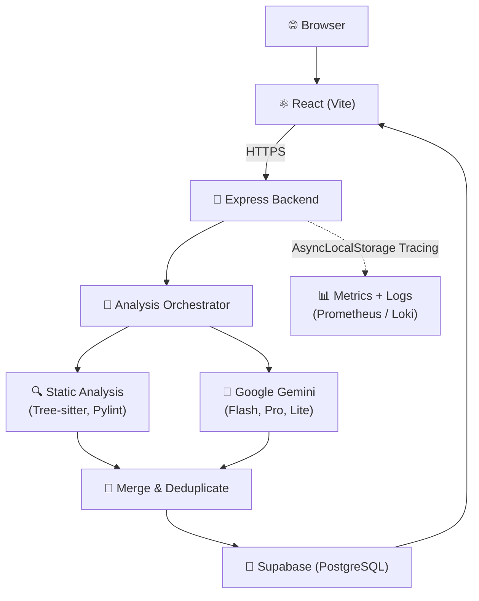
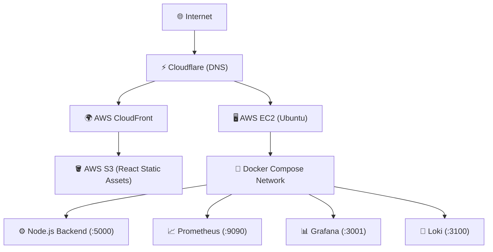

# DevGuard-AI

**AI-powered code review platform with multi-language static analysis, team collaboration, and production-grade observability.**

[**Live Demo**](https://devguard.dakshagarwal.dev) &nbsp;·&nbsp; [Report a Bug](https://github.com/Dakshh-Agarwal/DevGuard-AI/issues) &nbsp;·&nbsp; [Contribute](CONTRIBUTING.md)

---

| Metric | Value |
|---|---:|
| **Languages Supported** | 5 |
| **Docker Containers** | 5 |
| **REST Endpoints** | 23+ |
| **Custom Metrics** | 20 |
| **Grafana Panels** | 16 |
| **Runtime Tests** | 57 |
| **Load Tested** | 30k reqs |
| **AI Models** | 3 |
| **Static Analyzers** | 4 |

---

> [!IMPORTANT]
> **Runtime Verified**
>
> The monitoring stack is automatically validated using a custom 7-phase runtime validation suite that executes live queries and traffic to check:
> * Backend & API health
> * Prometheus scrape targets
> * Grafana datasource provisioning
> * 14 Prometheus dashboard queries
> * 4 Loki LogQL queries
> * Structured JSON log schema and secret sanitization
> * Sustained 10s load test (3,000+ req/s)

---

## Documentation

This README provides a high-level overview. For deep technical details, refer to the `docs/` directory:

- 📊 **[Monitoring & Observability](docs/MONITORING.md)** (Prometheus, Loki, Grafana, LogQL)
- 🏗️ **[Architecture & Pipeline](docs/ARCHITECTURE.md)** (AI fallback chain, Static Tools)
- 🔌 **[API Reference](docs/API.md)** (REST Endpoints, JSON Schemas)
- 🚀 **[Deployment & Environment](docs/DEPLOYMENT.md)** (EC2, Docker Compose, Env Vars)
- 🔒 **[Security & Authentication](docs/SECURITY.md)** (JWT, OAuth, RBAC)

---

## Screenshots

*(Screenshots will be placed here — Landing Page, Code Editor, AI Review Results, Team Dashboard, Grafana Dashboard, Prometheus, Loki, Docker)*

---

## Design Principles

- **Reliability before convenience** — Extensive fallback chains and retries for external APIs.
- **Observability by default** — If a route isn't instrumented, it doesn't ship.
- **Secure-by-default APIs** — Mandatory server-side token verification and zero-trust parameter handling.
- **Structured logging** — Winston JSON logs ready for Loki stream ingestion.
- **Fail gracefully** — 45-second timeouts protect the Express event loop from degrading upstream services.
- **Production-first development** — Built with real-world infrastructure constraints in mind.

---

## Component Architecture

DevGuard-AI is designed with clear boundaries between the frontend application, the routing layer, the analysis orchestration, and the observability stack.

---

## Deployment Architecture

The application is deployed across AWS and Supabase, utilizing CloudFront for global static asset distribution and Docker on EC2 for the resilient backend and monitoring stack.

---

## Engineering Highlights

- **Multi-model Gemini fallback** — Resilient AI pipeline with exponential backoff and strict JSON enforcement.
- **Structured JSON logging** — Optimized for fast LogQL queries and automated dashboarding.
- **Production observability** — Comprehensive instrumentation of HTTP, DB, AI, and static analysis layers.
- **Runtime validation framework** — Bespoke test suite that executes actual PromQL/LogQL queries against the live stack.
- **Dockerized monitoring stack** — Prometheus, Loki, Promtail, and Grafana auto-provisioned with custom dashboards.
- **Team collaboration architecture** — Role-based access control with distinct peer and code review flows.

> [!TIP]
> **💡 Why AsyncLocalStorage?**
>
> Passing `request_id` manually through every single function call (from routes to AI clients to database helpers) creates tightly coupled, messy code. 
> 
> By utilizing `AsyncLocalStorage`, DevGuard-AI keeps the request context available throughout the entire asynchronous execution lifetime without changing function signatures. The Winston logger automatically extracts this context and injects tracing metadata invisibly into every log line.

> [!TIP]
> **💡 Why `dynamicLabels: false` for Loki?**
>
> Naively logging `request_id` as a label in Loki causes stream explosion (Loki limits streams to 10k by default), quickly crashing the server in production.
>
> We disabled dynamic labels in the Winston-Loki transport. Only the `service` name is sent as a stream label. The `request_id` and `user_id` are serialized into the JSON payload, making them heavily indexed for LogQL filtering (`| json | request_id="..."`) without generating memory-crashing streams.

---

## Challenges & Solutions

| Challenge | Solution |
|---|---|
| **Gemini JSON responses** | Enforced JSON mode with automatic retry + strict fallback parsing |
| **Loki label explosion** | Disabled dynamic labels; injected metadata into JSON payload instead |
| **Long-running AI requests** | Multi-model fallback chain with aggressive 45s timeouts |
| **Multi-file overload** | Serialized memory queue with queue-depth Prometheus metrics |
| **Observability validation** | Built a 7-phase runtime verification script hitting real endpoints |

---

## Engineering Journey

- **Phase 1:** Single file AI review
- **Phase 2:** Multi-language support (Pylint, Checkstyle, Tree-sitter)
- **Phase 3:** GitHub Integration (OAuth & Repository browsing)
- **Phase 4:** Teams (Role-based access & Dashboard Analytics)
- **Phase 5:** Observability (Prometheus, Loki, Grafana)
- **Phase 6:** Production Deployment & Runtime Validation

---

## Future Improvements & Limitations

**What DevGuard-AI is not:**
- It does not execute submitted code.
- It does not run tests.
- It does not connect directly to CI/CD pipelines (yet).
- Analysis is performed by reading source text, not by running it.

**Planned Improvements:**
- Rate limiting on analysis endpoints to prevent abuse.
- Result caching — identical code + language could skip redundant Gemini calls.
- Webhook integration — trigger analysis directly from GitHub pull request events.

---

## License

ISC License — see repository root for details.

---

Built with Node.js &nbsp;·&nbsp; React &nbsp;·&nbsp; Google Gemini &nbsp;·&nbsp; Supabase &nbsp;·&nbsp; Prometheus &nbsp;·&nbsp; Grafana &nbsp;·&nbsp; Loki

