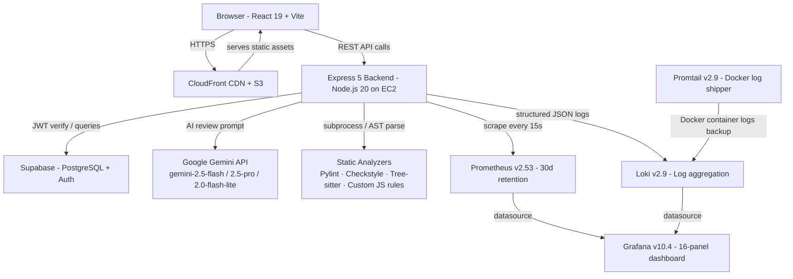
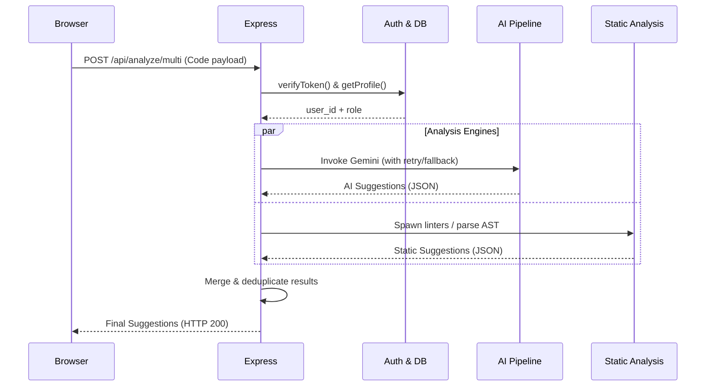

# Architecture

## Architecture



### API Data Flow



### Request Lifecycle

Every HTTP request passes through this middleware chain before reaching a route handler:

```
Incoming request
    │
    â–¼
requestContextMiddleware    ── generates UUID request_id, sets up AsyncLocalStorage
    │
    â–¼
metricsMiddleware           ── increments active gauge, starts hrtime timer
    │
    â–¼
CORS middleware             ── allowlist: devguard.dakshagarwal.dev, CloudFront, localhost
    │
    â–¼
express.json()              ── body parsing
    │
    â–¼
Route handler
    │
    ├── verifyUserToken (protected routes)
    │       └── supabase.auth.getUser(token)
    │               └── setRequestUserId() → writes user_id into AsyncLocalStorage
    │
    ├── Business logic / AI pipeline / static analysis
    │
    └── Response
            │
            â–¼
    res.on('finish')
    metricsMiddleware records: httpRequestsTotal, httpRequestDuration, httpActiveRequests.dec()
```

---

## AI Review Pipeline


### Model Selection and Retry Logic

The review function iterates through three Gemini models. For each model, up to three calls are attempted with exponential backoff (2 s → 4 s → 8 s). Each call is wrapped in a `Promise.race` with a 45-second timeout to prevent the server from hanging on a degraded API.

```
gemini-2.5-flash      → 3 attempts × 45s timeout each
         ↓ if all fail
gemini-2.5-pro        → 3 attempts × 45s timeout each
         ↓ if all fail
gemini-2.0-flash-lite → 3 attempts × 45s timeout each
         ↓ if all fail
Fallback response returned — never throws an error to the client
```

### JSON Enforcement

All prompts use `responseMimeType: "application/json"`. If the response does not begin with `{`, a second strict-mode prompt is sent automatically to extract valid JSON before the result is returned. This prevents markdown-wrapped responses or commentary from reaching the JSON parser.

### Rejection Feedback Loop

When a user rejects a suggestion, the decision is stored in the `feedback` table. On the next analysis of the same code, the backend queries past rejections and injects them into the Gemini prompt:

```
Don't repeat these rejected suggestions for non-critical issues:
1. "Use let instead of var"
Don't give style or best-practice suggestions on lines: [14, 22]
```

Critical types (`syntax`, `logical`, `semantic`) are always reported, regardless of rejection history.

### Multi-File Context

For multi-file submissions, each file is reviewed with additional prompt context:
- Total file count and languages across the project
- Summaries of up to 5 sibling files (name, language, line count) to avoid token overflow
- A cross-file instruction set focused on architecture patterns, coupling, duplication, and security vectors that span files

---

## Static Analysis Engines

### Python — Pylint

Submitted code is written to a temp file and `analyze_python.py` is invoked as a subprocess. The script runs Pylint with its JSON reporter and returns structured diagnostics. The temp file is deleted in a `finally` block regardless of outcome. Execution time is recorded in the `devguard_pylint_duration_seconds` histogram.

### JavaScript — Custom Rule Engine

`analyzeJS.js` scans each line with regex patterns for:
- `console.log` calls left in production code
- `var` declarations (recommends `let` or `const`)
- Empty `catch` blocks

Runs in-process with nanosecond-precision timing via `process.hrtime.bigint()`.

### Java — Checkstyle

Checkstyle is invoked via `child_process.exec()` using the Google Java Style XML configuration. Output is parsed line by line, filtered to the submitted file's basename, and returned as structured suggestions. Execution time is recorded in `devguard_checkstyle_duration_seconds`.

### C / C++ — Tree-sitter

`node-tree-sitter` parses the submitted code into a concrete syntax tree using the CPP grammar. A recursive AST walker flags:
- Function definitions (structural inventory)
- Variable declarations without initialization
- Functions longer than 15 lines (refactoring candidate)
- Standalone `void` return types

Timing is recorded in `devguard_treesitter_duration_seconds`.

---
