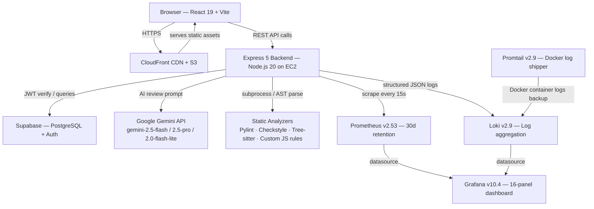
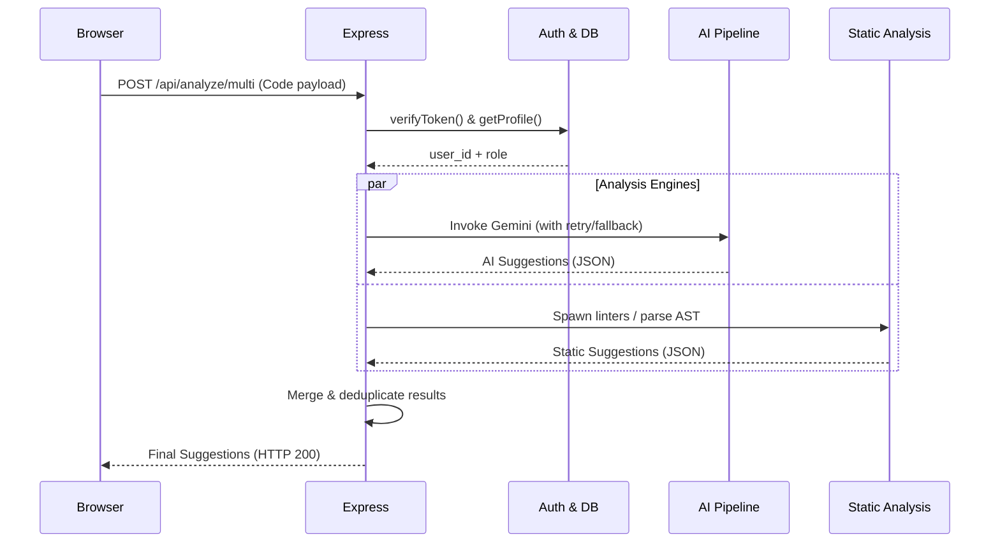
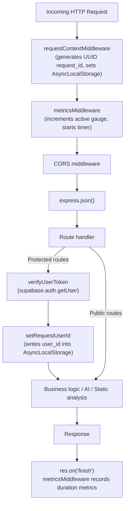
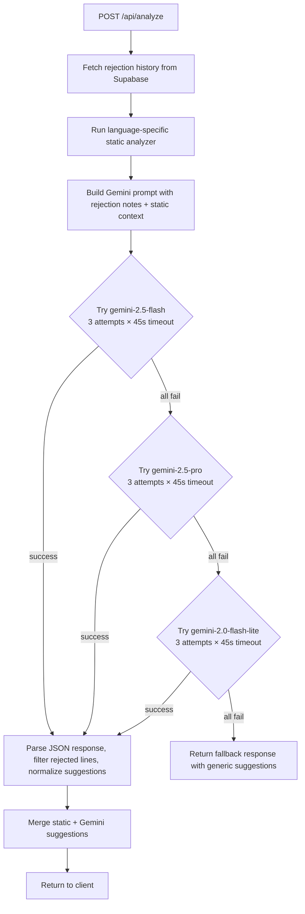

# Architecture

## System Overview

DevGuard-AI is a full-stack code review platform built around three pillars: **AI-assisted analysis**, **multi-language static analysis**, and **production-grade observability**. The frontend is a React 19 SPA served via CloudFront/S3, and the backend is an Express 5 API running inside Docker on EC2, backed by Supabase for persistence and authentication.



---

## API Data Flow

The sequence below shows what happens when a user submits code for review via `POST /api/analyze/multi`:



---

## Request Lifecycle

Every HTTP request passes through this middleware chain before reaching a route handler:



**Key implementation details:**

- `requestContextMiddleware` runs first. It generates a UUID `request_id`, attaches it to `req.requestId`, sets the `X-Request-ID` response header, and creates an `AsyncLocalStorage` store for the lifetime of the request.
- `metricsMiddleware` skips `/health` and `/metrics` to prevent internal traffic from polluting dashboards. It increments `devguard_http_active_requests`, and on `res.finish` records `devguard_http_requests_total` and `devguard_http_request_duration_seconds`.
- Route normalization replaces UUIDs and numeric IDs in paths with `:id` to prevent Prometheus cardinality explosion.

---

## AI Review Pipeline



### Model Selection and Retry Logic

The review function iterates through three Gemini models. For each model, up to three calls are attempted with exponential backoff (2s → 4s → 8s). Each call is wrapped in a `Promise.race` with a 45-second timeout to prevent the server from hanging on a degraded API.

```text
gemini-2.5-flash      -> 3 attempts × 45s timeout each
         ↓ if all fail
gemini-2.5-pro        -> 3 attempts × 45s timeout each
         ↓ if all fail
gemini-2.0-flash-lite -> 3 attempts × 45s timeout each
         ↓ if all fail
Fallback response returned — never throws an error to the client
```

### JSON Enforcement

All prompts use `responseMimeType: "application/json"`. If the response does not begin with `{`, a second strict-mode prompt is sent automatically to extract valid JSON before the result is returned. This prevents markdown-wrapped responses or commentary from reaching the JSON parser.

### Rejection Feedback Loop

When a user rejects a suggestion, the decision is stored in the `feedback` table. On the next analysis of the same code, the backend queries past rejections and injects them into the Gemini prompt:

```
Don't repeat these rejected suggestions for non-critical issues:
1. "Use let instead of var"
Don't give style or best-practice suggestions on lines: [14, 22]
```

Critical types (`syntax`, `logical`, `semantic`) are always reported, regardless of rejection history.

### Multi-File Context

For multi-file submissions, each file is reviewed with additional prompt context:
- Total file count and languages across the project
- Summaries of up to 5 sibling files (name, language, line count) to avoid token overflow
- A cross-file instruction set focused on architecture patterns, coupling, duplication, and security vectors that span files

---

## Static Analysis Engines

### Python — Pylint

Submitted code is written to a temp file and `analyze_python.py` is invoked as a subprocess. The script runs Pylint with its JSON reporter and returns structured diagnostics. The temp file is deleted in a `finally` block regardless of outcome. Execution time is recorded in the `devguard_pylint_duration_seconds` histogram.

### JavaScript — Custom Rule Engine

`analyzeJS.js` scans each line with regex patterns for:
- `console.log` calls left in production code
- `var` declarations (recommends `let` or `const`)
- Empty `catch` blocks

Runs in-process with nanosecond-precision timing via `process.hrtime.bigint()`.

### Java — Checkstyle

Checkstyle is invoked via `child_process.exec()` using the Google Java Style XML configuration. Output is parsed line by line, filtered to the submitted file's basename, and returned as structured suggestions. Execution time is recorded in `devguard_checkstyle_duration_seconds`.

### C / C++ — Tree-sitter

`node-tree-sitter` parses the submitted code into a concrete syntax tree using the CPP grammar. A recursive AST walker flags:
- Function definitions (structural inventory)
- Variable declarations without initialization
- Functions longer than 15 lines (refactoring candidate)
- Standalone `void` return types

Timing is recorded in `devguard_treesitter_duration_seconds`.

---

## Frontend Architecture

The frontend is a React 19 SPA built with Vite. Key pages:

| Page | Path | Purpose |
|---|---|---|
| Home | `/` | Landing page with feature overview |
| Login / Signup | `/login`, `/signup` | Supabase email/password auth |
| GitHub Callback | `/github-callback` | GitHub OAuth token exchange |
| Editor | `/editor` | CodeMirror-based code editor with AI review |
| Teams | `/teams` | Team listing and navigation |
| Leader Dashboard | `/leader/:teamId` | Team lead analytics (Recharts) |
| Member Dashboard | `/member/:teamId` | Member-specific review history |
| Admin Dashboard | `/admin` | Admin-only system analytics |
| Create / Join Team | `/create-team`, `/join/:teamId` | Team management flows |

The editor uses CodeMirror 6 with language extensions for Python, JavaScript, Java, and C/C++, providing syntax highlighting and bracket matching during code review.

---
