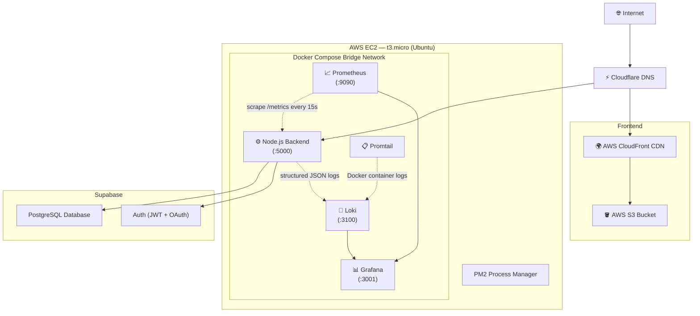

# Deployment

## Architecture Overview

DevGuard-AI is deployed across three managed services, each chosen to solve a specific infrastructure constraint:



---

## Why This Architecture

### Frontend: S3 + CloudFront

The React frontend is completely decoupled from the backend. After `vite build`, the static output (`dist/`) is uploaded to an S3 bucket and served through CloudFront's global edge network. This approach:
- Reduces backend load to zero for UI rendering
- Serves assets from the nearest edge location
- Provides automatic HTTPS via CloudFront's managed certificate

The backend server never handles static file requests.

### Backend: Docker Compose on EC2

The Node.js API and the entire observability suite run within an isolated Docker bridge network on an Ubuntu EC2 instance. Services communicate through internal DNS (e.g., `http://loki:3100`), which means monitoring ports are never exposed to the public internet. The entire stack is deployed with a single command:

```bash
docker-compose up -d
```

### Backend HTTPS: CloudFront as Reverse Proxy

A second CloudFront distribution sits in front of the EC2 instance's port 5000, providing HTTPS termination for the API without requiring Nginx or Certbot configuration on the instance itself.

### Database: Supabase

Supabase provides PostgreSQL and authentication as a managed service. This eliminates the need to self-host a database on a resource-constrained t3.micro instance, while providing:
- Row-level security policies
- JWT-based authentication
- OAuth provider management (GitHub)
- Admin API for user management

### Process Manager: PM2

PM2 keeps the backend process alive across server restarts and crashes. On the EC2 instance, PM2 manages the Docker Compose lifecycle and ensures the stack restarts after an OS reboot.

### Static IP: Elastic IP

An AWS Elastic IP is assigned to the EC2 instance so the DNS records remain stable across instance stop/start cycles. Without this, every reboot would assign a new public IP, breaking CloudFront origin configuration and Cloudflare DNS records.

### Memory Safety: Swap File

The t3.micro instance has 1 GB of RAM. During heavy multi-file analysis (which can spike memory when Pylint, Tree-sitter, and Gemini API calls run concurrently), a 2 GB swap file prevents the Linux OOM killer from terminating Docker containers:

```bash
sudo fallocate -l 2G /swapfile
sudo chmod 600 /swapfile
sudo mkswap /swapfile
sudo swapon /swapfile
echo '/swapfile none swap sw 0 0' | sudo tee -a /etc/fstab
```

### Region: ap-south-2 (Hyderabad)

The EC2 instance is deployed in AWS's Hyderabad region to minimize API latency for Indian users, where the primary user base is located.

---

## Docker Compose Services

The `docker-compose.yml` defines five services on a shared bridge network:

| Service | Image | Port | Purpose |
|---|---|---|---|
| `devguard-backend` | Custom (Dockerfile) | 5000 | Express API with Pylint, JDK 11, Tree-sitter |
| `prometheus` | `prom/prometheus:v2.53.0` | 9090 | Metrics collection with 30-day retention |
| `loki` | `grafana/loki:2.9.0` | 3100 | Log aggregation |
| `promtail` | `grafana/promtail:2.9.0` | — | Ships Docker container logs to Loki |
| `grafana` | `grafana/grafana:10.4.0` | 3001 | Visualization with auto-provisioned dashboards |

### Backend Dockerfile

The backend container is built from `node:20-alpine` and installs:
- Python 3 + pip + Pylint (for Python static analysis)
- OpenJDK 11 JRE (for Checkstyle Java analysis)
- Node.js production dependencies via `npm ci --production`

A Docker `HEALTHCHECK` pings `/health` every 30 seconds:

```dockerfile
HEALTHCHECK --interval=30s --timeout=5s --start-period=10s --retries=3 \
  CMD wget --spider --quiet http://localhost:5000/health || exit 1
```

---

## Environment Variables

Copy `server/.env.example` to `server/.env` and fill in your values:

| Variable | Required | Description |
|---|---|---|
| `PORT` | Yes | Server port (default: `5000`) |
| `GEMINI_API_KEY` | Yes | Google Gemini API key |
| `SUPABASE_URL` | Yes | Supabase project URL |
| `SUPABASE_ANON_KEY` | Yes | Supabase anonymous key |
| `SUPABASE_SERVICE_ROLE_KEY` | Yes | Supabase service role key (admin operations) |
| `GITHUB_CLIENT_ID` | Yes | GitHub OAuth App client ID |
| `GITHUB_CLIENT_SECRET` | Yes | GitHub OAuth App client secret |
| `VITE_FRONTEND_URL` | Yes | Frontend URL (for team invite links) |
| `LOKI_URL` | No | Loki endpoint (auto-set in Docker: `http://loki:3100`) |
| `METRICS_USER` | No | Basic auth username for `/metrics` (default: `admin`) |
| `METRICS_PASS` | No | Basic auth password for `/metrics` (default: `devguard-metrics`) |
| `LOG_LEVEL` | No | Winston log level (default: `info`) |

---

## Local Development

```bash
# Clone the repository
git clone https://github.com/Dakshh-Agarwal/DevGuard-AI.git
cd DevGuard-AI

# Start the monitoring stack
docker-compose up -d

# Install and run the backend
cd server
cp .env.example .env   # Fill in your keys
npm install
node index.js

# Install and run the frontend (separate terminal)
cd client
npm install
npm run dev
```

The frontend runs at `http://localhost:5173`, the backend at `http://localhost:5000`, and Grafana at `http://localhost:3001`.

---
