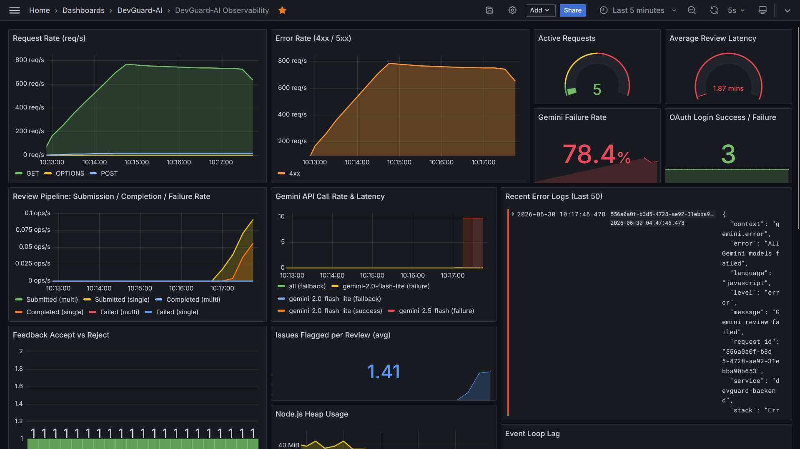
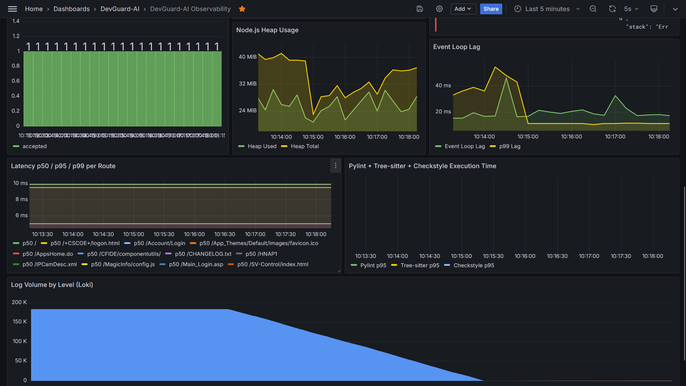
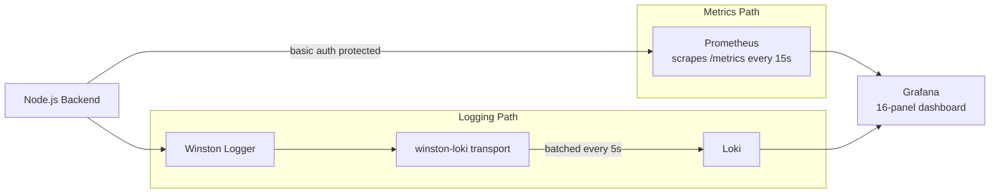

# Monitoring & Observability

DevGuard-AI ships with a complete observability stack: **Prometheus** for metrics, **Loki** for logs, and **Grafana** for visualization. Every layer of the application — HTTP, AI pipeline, static analysis, database, OAuth, and feedback — is instrumented.




---

## Observability Flow



---

## Prometheus Metrics

All metrics are registered on a custom `prom-client` registry under the `devguard_` prefix. Default Node.js metrics (event loop lag, heap, GC, CPU) are also collected.

### HTTP Layer (3 metrics)

| Metric | Type | Labels | Description |
|---|---|---|---|
| `devguard_http_requests_total` | Counter | `method`, `route`, `status_code` | Total HTTP requests |
| `devguard_http_request_duration_seconds` | Histogram | `method`, `route` | Request latency. Buckets: 10ms → 60s |
| `devguard_http_active_requests` | Gauge | — | Currently in-flight requests |

### Gemini AI Layer (4 metrics)

| Metric | Type | Labels | Description |
|---|---|---|---|
| `devguard_gemini_calls_total` | Counter | `model`, `status` | Total Gemini API calls. Status: `success`, `failure`, `fallback` |
| `devguard_gemini_duration_seconds` | Histogram | `model` | Gemini API latency. Buckets: 0.5s → 120s |
| `devguard_gemini_retries_total` | Counter | `model` | Total retry attempts across all models |
| `devguard_gemini_json_parse_errors_total` | Counter | — | Failed JSON parses from Gemini responses |

### Code Review Pipeline (5 metrics)

| Metric | Type | Labels | Description |
|---|---|---|---|
| `devguard_reviews_submitted_total` | Counter | `type` | Reviews submitted. Type: `single`, `multi` |
| `devguard_reviews_completed_total` | Counter | `type`, `status` | Reviews completed. Status: `success`, `failure` |
| `devguard_review_duration_seconds` | Histogram | `type`, `language` | End-to-end review latency. Buckets: 0.5s → 300s |
| `devguard_review_issues_total` | Histogram | `language`, `source` | Issues flagged per review. Source: `static`, `gemini` |
| `devguard_review_queue_size` | Gauge | — | Current multi-file queue depth |

### Static Analysis (4 metrics)

| Metric | Type | Labels | Description |
|---|---|---|---|
| `devguard_pylint_duration_seconds` | Histogram | — | Pylint execution time |
| `devguard_treesitter_duration_seconds` | Histogram | — | Tree-sitter C/C++ parse time |
| `devguard_checkstyle_duration_seconds` | Histogram | — | Checkstyle Java execution time |
| `devguard_static_analysis_errors_total` | Counter | `tool` | Static analysis failures. Tool: `pylint`, `treesitter`, `checkstyle`, `eslint` |

### GitHub OAuth (1 metric)

| Metric | Type | Labels | Description |
|---|---|---|---|
| `devguard_oauth_attempts_total` | Counter | `status` | OAuth attempts. Status: `success`, `failure`, `duplicate` |

### Supabase / Database (2 metrics)

| Metric | Type | Labels | Description |
|---|---|---|---|
| `devguard_supabase_query_duration_seconds` | Histogram | `table`, `operation` | Query latency by table and operation |
| `devguard_supabase_errors_total` | Counter | `table`, `operation` | Query failures |

### Feedback Loop (1 metric)

| Metric | Type | Labels | Description |
|---|---|---|---|
| `devguard_feedback_decisions_total` | Counter | `decision`, `suggestion_type` | Accept/reject decisions by suggestion type |

**Total: 20 custom metrics**

---

## Zero-Initialization

Sparse counters are zero-initialized at startup to prevent `rate()` from dropping the first event. All three Gemini models are pre-registered with `success`, `failure`, and `fallback` statuses. Review counters for `single` and `multi` types are also pre-seeded. This ensures Grafana panels show data from the very first request.

---

## Prometheus Configuration

Prometheus is configured in `monitoring/prometheus.yml`:

```yaml
global:
  scrape_interval: 15s
  evaluation_interval: 15s

scrape_configs:
  - job_name: 'devguard-backend'
    metrics_path: '/metrics'
    scrape_interval: 15s
    basic_auth:
      username: admin
      password: devguard-metrics
    static_configs:
      - targets: ['devguard-backend:5000']
        labels:
          service: 'devguard-backend'
          environment: 'production'
```

The `devguard-backend:5000` target uses Docker's internal DNS. Prometheus authenticates with the basic auth credentials set on the `/metrics` endpoint. Data is retained for 30 days (`--storage.tsdb.retention.time=30d`).

---

## Structured Logging (Winston → Loki)

### Log Format

Every log line is a JSON object with automatic context injection:

```json
{
  "timestamp": "2026-06-30 10:15:42.123",
  "level": "info",
  "message": "Gemini succeeded with gemini-2.5-flash",
  "service": "devguard-backend",
  "request_id": "a1b2c3d4-e5f6-...",
  "user_id": "f7g8h9i0-...",
  "model": "gemini-2.5-flash",
  "duration_sec": "3.142",
  "context": "gemini.success"
}
```

### Context Field Convention

Every structured log includes a `context` field that acts as a namespaced category for LogQL filtering:

| Context | Meaning |
|---|---|
| `auth.verify` | JWT token verification |
| `gemini.prompt` | Prompt construction |
| `gemini.success` | Successful Gemini call |
| `gemini.failure` | Failed Gemini attempt |
| `gemini.fallback` | All models exhausted |
| `gemini.retry` | Retry attempt |
| `gemini.parse` | JSON parse error |
| `analyze.single` | Single-file analysis |
| `analyze.multi` | Multi-file analysis |
| `analyze.pylint` | Pylint execution |
| `analyze.treesitter` | Tree-sitter parsing |
| `github.oauth` | GitHub OAuth flow |
| `teams.create` | Team creation |
| `stats.dashboard` | Admin stats fetch |

### Loki Transport Configuration

The Winston-Loki transport is configured with `dynamicLabels: false`. This is a critical design decision — if enabled, every metadata key (`request_id`, `user_id`, `model`, etc.) would become a Loki stream label, creating millions of unique streams. Loki has a default limit of 10,000 streams and would reject ingestion or crash under load.

Instead, only `service: 'devguard-backend'` is sent as a static stream label. All other fields are serialized into the JSON log line and queried with LogQL's JSON parser:

```logql
{service="devguard-backend"} | json | context="gemini.failure"
{service="devguard-backend"} | json | request_id="a1b2c3d4"
{service="devguard-backend"} | json | level="error" | line_format "{{.message}}"
```

---

## Grafana Dashboard Panels

The provisioned dashboard (`devguard.json`) contains 16 panels organized across the full width of the viewport:

### Row 1 — Real-Time Overview

| Panel | Type | Query Source | Description |
|---|---|---|---|
| Request Rate (req/s) | Time series | `rate(devguard_http_requests_total[1m])` | HTTP traffic by method (GET, POST, OPTIONS) |
| Error Rate (4xx/5xx) | Time series | `rate(devguard_http_requests_total{status_code=~"4.."}[1m])` | Client error rate over time |
| Active Requests | Gauge | `devguard_http_active_requests` | Current in-flight request count |
| Average Review Latency | Gauge | `rate(devguard_review_duration_seconds_sum[5m]) / rate(devguard_review_duration_seconds_count[5m])` | Average end-to-end review time |

### Row 2 — AI & Pipeline

| Panel | Type | Query Source | Description |
|---|---|---|---|
| Review Pipeline | Time series | `rate(devguard_reviews_submitted_total[1m])` | Submission, completion, and failure rates |
| Gemini API Call Rate & Latency | Time series | `rate(devguard_gemini_calls_total[1m])` | Call rate per model with success/failure/fallback |
| Recent Error Logs | Logs (Loki) | `{service="devguard-backend"} \| json \| level="error"` | Real-time error log stream |
| Gemini Failure Rate | Gauge | Failure ratio across all models | Percentage of Gemini calls that fail |
| OAuth Login Success/Failure | Stat | `devguard_oauth_attempts_total` | Total OAuth login attempts |

### Row 3 — Feedback & Health

| Panel | Type | Query Source | Description |
|---|---|---|---|
| Feedback Accept vs Reject | Bar chart | `devguard_feedback_decisions_total` | Stacked accept/reject decisions |
| Issues Flagged per Review (avg) | Stat + bar | `devguard_review_issues_total` | Average issues found per review |
| Node.js Heap Usage | Time series | `devguard_nodejs_heap_space_size_used_bytes` | Heap used vs total over time |
| Event Loop Lag | Time series | `devguard_nodejs_eventloop_lag_p99_seconds` | p50 and p99 event loop lag |

### Row 4 — Deep Diagnostics

| Panel | Type | Query Source | Description |
|---|---|---|---|
| Latency p50/p95/p99 per Route | Time series | `histogram_quantile(0.5, rate(devguard_http_request_duration_seconds_bucket[5m]))` | Per-route latency percentiles |
| Pylint + Tree-sitter + Checkstyle Execution Time | Time series | `histogram_quantile(0.95, rate(devguard_pylint_duration_seconds_bucket[5m]))` | Static analysis tool latency |
| Log Volume by Level (Loki) | Time series (Loki) | `sum by (level) (count_over_time({service="devguard-backend"} \| json [1m]))` | Log volume breakdown: info, warn, error |

---

## Runtime Validation

The repository includes a 717-line runtime validation script (`server/runtime_validation.js`) that runs a 7-phase verification suite against the live stack:

| Phase | What It Tests |
|---|---|
| 1. Connectivity | Backend `/health`, Prometheus `/api/v1/status/config`, Loki `/ready`, Grafana `/api/health` |
| 2. Datasources | Grafana API — verifies Prometheus and Loki datasources are provisioned |
| 3. Traffic Generation | Sends real HTTP and analysis requests to populate metrics |
| 4. PromQL Queries | Runs every dashboard PromQL expression against `prometheus/api/v1/query` |
| 5. LogQL Queries | Runs LogQL queries against `loki/api/v1/query_range` |
| 6. Log Schema | Validates JSON structure, field presence, and secret sanitization |
| 7. Load Test | 10-second sustained burst verifying throughput and error rates |

Run with:

```bash
node server/runtime_validation.js
```

The script outputs a panel-by-panel pass/fail/warn report at the end.

---

## Troubleshooting

### No data in Grafana panels

1. Check that Prometheus is scraping successfully: visit `http://localhost:9090/targets`.
2. Verify the `/metrics` endpoint returns data: `curl -u admin:devguard-metrics http://localhost:5000/metrics`.
3. Confirm the Grafana datasource is configured: `http://localhost:3001 → Configuration → Data sources`.

### Loki not receiving logs

1. Verify the `LOKI_URL` environment variable is set (Docker sets it to `http://loki:3100`).
2. Check the Winston-Loki transport initialized: look for `Initializing Loki transport at:` in backend console output.
3. Query Loki directly: `curl http://localhost:3100/loki/api/v1/query?query={service="devguard-backend"}`.

### High memory on t3.micro

- Ensure the swap file is active: `swapon --show`.
- Check container memory with `docker stats`.
- Multi-file analysis is the heaviest operation — the serialized queue (`isProcessingMultiFile` flag) prevents concurrent processing.

---
